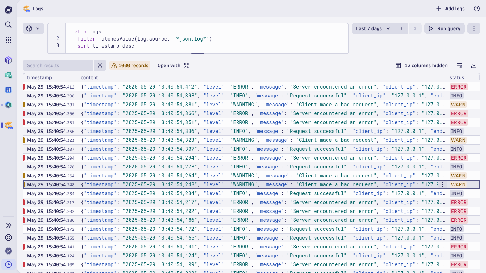
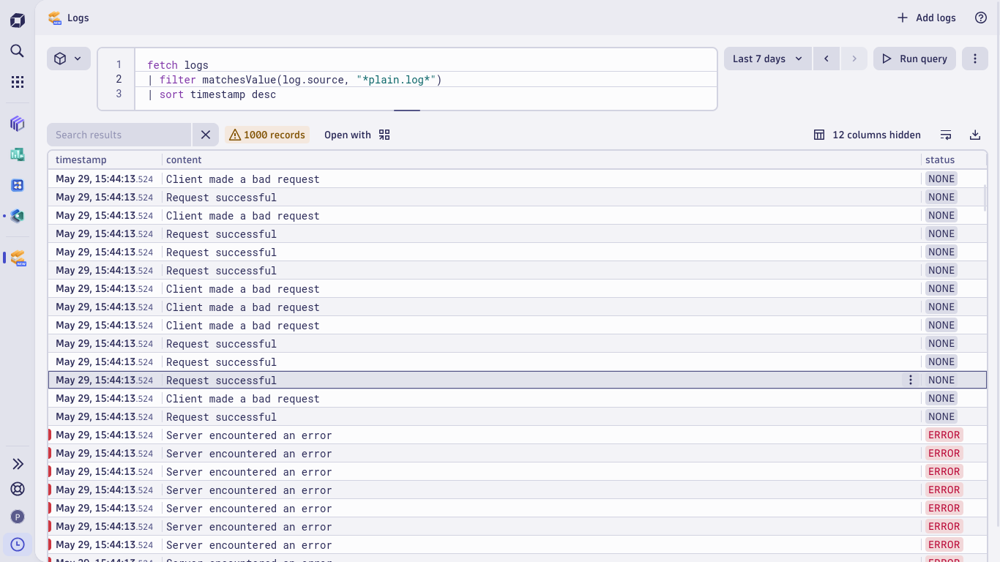

# Flask Logging Comparison for Dynatrace

This repository demonstrates two logging approaches in a Flask application – **JSON formatted logs** and **plain text logs** – to highlight the benefits of using structured logs when querying logs with Dynatrace Query Language (DQL). With JSON logs, each log entry is structured into clear fields (e.g., timestamp, log level, message, client IP, endpoint, and status code), making queries more readable and eliminating the need for complex string manipulations required with plain text logs.

## Project Overview

In modern monitoring solutions, having structured logs significantly improves the efficiency of troubleshooting and data analysis. This project showcases:

- **JSON Logs:**  
  Log entries are output as JSON objects. Each structured log includes properties like `timestamp`, `level`, `message`, `client_ip`, `endpoint`, and `status_code`, which makes them directly accessible and filterable using Dynatrace Query Language (DQL).

- **Plain Text Logs:**  
  Log entries are recorded as plain text. Although simpler, these require additional string manipulation to extract useful information for analysis.

Both variants expose identical endpoints (`/info`, `/warning`, and `/error`) that simulate different HTTP status codes (200, 400, 500) to generate corresponding log entries.

## File Breakdown

### `json_logs.py`
- **Purpose:** Demonstrates structured logging using a custom `JSONFormatter`.
- **Key Features:**
  - Custom formatter builds a JSON object for each log entry, including:
    - `timestamp`
    - `level`
    - `message`
    - `client_ip` (derived from the request, or "unknown")
    - `endpoint` (the request path, or "unknown")
    - `status_code` (supplied via `extra`)
  - Logs are written to the file `json.log`.
  - Endpoints implemented:
    - `/info`: Logs an INFO level message.
    - `/warning`: Logs a WARNING level message.
    - `/error`: Logs an ERROR level message.

### `plain_logs.py`
- **Purpose:** Demonstrates standard plain text logging.
- **Key Features:**
  - Logs messages as plain text to `plain.log` without a custom formatter.
  - Uses the same endpoints as the JSON version for a direct comparison.

### `Vagrantfile`
- **Purpose:** Provides a reproducible virtual machine setup.
- **Key Features:**
  - Uses the `debian/bookworm64` box.
  - Allocates 4GB of memory and 2 CPUs.
  - Sets the hostname to "dynatrace" to ease network configuration during testing.

### `test_flask_app.sh`
- **Purpose:** Simulates application traffic to generate log entries.
- **Key Features:**
  - Runs a loop (1111 iterations) that randomly hits one of the endpoints (`/info`, `/warning`, or `/error`) via `curl`.
  - Helps generate sufficient log data to compare JSON vs. plain text logging results.

### Log Sample Images
- **`json_logs.png`:**  
  Provides a screenshot showing the resulting structured logs in Dynatrace.
- **`plain_logs.png`:**  
  Provides a screenshot showing the plain text log outputs in Dynatrace.

## Setup & Execution

### Prerequisites

- **Python 3.x & Flask**  
- **Vagrant**  
- **Dynatrace OneAgent**  

### Instructions

1. **Testing JSON Logging Workflow:**

   **Step 1: Launch the Flask Application Using JSON Logging**
   ```bash
   python3 json_logs.py
   ```

   **Step 2: Simulate Traffic**
   In another terminal (or within the VM), run:
   ```bash
   ./test_flask_app.sh
   ```

   **Step 3: Query Logs in Dynatrace**
   - Open the Dynatrace logs service.
   - Execute the following DQL query:
     ```
     fetch logs
     | filter matchesValue(log.source, "*json.log*")
     | sort timestamp desc
     ```
   - Review the results and compare them to the screenshot provided in `json_logs.png` to ensure logs are properly structured.
    
   
   **Step 4: Stop the JSON Flask Application**
   - Press `CTRL+C` in the terminal running `json_logs.py` to stop the server.

1. **Testing Plain Text Logging Workflow:**

   **Step 1: Launch the Flask Application Using Plain Logging**
   ```bash
   python3 plain_logs.py
   ```

   **Step 2: Simulate Traffic**
   Run the test script again:
   ```bash
   ./test_flask_app.sh
   ```

   **Step 3: Query Logs in Dynatrace**
   - Open the Dynatrace logs service.
   - Execute the following DQL query:
     ```
     fetch logs
     | filter matchesValue(log.source, "*plain.log*")
     | sort timestamp desc
     ```
   - Review the results and compare them with the screenshot provided in `plain_logs.png` to observe the differences in log formatting.
    

   
   **Step 4: Stop the Plain Text Flask Application**
   - Press `CTRL+C` in the terminal running `plain_logs.py` to stop the server.

## Advantages of JSON Logging with Dynatrace

- **Structured Queries:**  
  With JSON logs, individual fields (like `status_code` and `endpoint`) can be queried directly, simplifying data extraction.
- **Enhanced Readability & Analysis:**  
  The clear separation of log attributes reduces the need for manual string parsing and allows for more straightforward troubleshooting.
- **Efficient Data Processing:**  
  Filtering, sorting, and aggregating log data become more efficient as each log entry adheres to a standardized JSON format.
